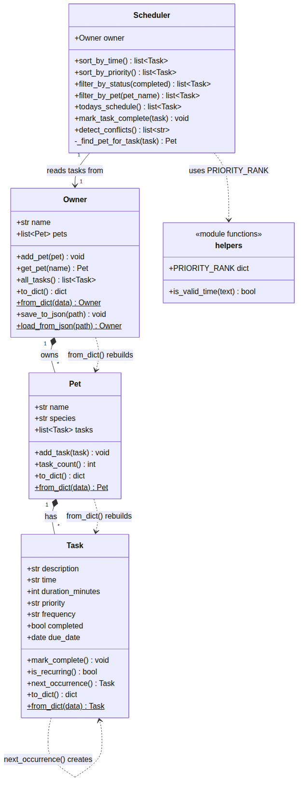

# PawPal+ (Module 2 Project)

**PawPal+** is a Streamlit app that helps a pet owner plan care tasks for their pets. The logic layer (`pawpal_system.py`) is a small object-oriented system of `Owner`, `Pet`, `Task`, and `Scheduler` classes; `main.py` proves it works in the terminal, and `app.py` puts a UI on top of it.

## Scenario

A busy pet owner needs help staying consistent with pet care. They want an assistant that can:

- Track pet care tasks (walks, feeding, meds, enrichment, grooming, etc.)
- Consider constraints (time available, priority, owner preferences)
- Produce a daily plan and explain why it chose that plan

The system was designed first (UML), then implemented in Python, then connected to the Streamlit UI.

## ✨ Features

- **Owners, pets, and tasks as real objects.** An `Owner` holds many `Pet`s, each `Pet` holds its own `Task` list, and every `Task` knows its time, duration, priority, frequency, due date, and completion status.
- **Sorting by time.** `Scheduler.sort_by_time()` puts every task across every pet into `HH:MM` order.
- **Priority-based scheduling.** `Scheduler.sort_by_priority()` orders tasks high → medium → low, then by time inside each level.
- **Filtering.** `Scheduler.filter_by_pet()` and `Scheduler.filter_by_status()` narrow the list to one pet or to done/not-done tasks; `Scheduler.todays_schedule()` returns only what is still due today.
- **Conflict warnings.** `Scheduler.detect_conflicts()` returns a plain-English warning whenever two unfinished tasks land on the same day at the same time, whether they belong to the same pet or different pets.
- **Daily and weekly recurrence.** Marking a recurring task complete through `Scheduler.mark_task_complete()` automatically queues the next occurrence one day or one week later using `timedelta`.
- **Save and load.** `Owner.save_to_json()` / `Owner.load_from_json()` persist the whole owner → pets → tasks tree to `data.json` so the data survives a restart.
- **Input validation.** `is_valid_time()` rejects anything that is not a real 24-hour `HH:MM` time before it becomes a task.

## Getting started

### Setup

```bash
python -m venv .venv
source .venv/bin/activate  # Windows: .venv\Scripts\activate
pip install -r requirements.txt
```

### Run it

```bash
python main.py                  # CLI demo of the logic layer
python -m pytest                # automated tests
python -m streamlit run app.py  # the Streamlit app
```

### Project layout

| File | What it is |
|------|------------|
| `pawpal_system.py` | The logic layer: `Task`, `Pet`, `Owner`, `Scheduler`, plus `is_valid_time()` and `PRIORITY_RANK`. No Streamlit code in here. |
| `main.py` | CLI demo that exercises every Scheduler feature and prints a readable schedule. |
| `app.py` | Streamlit UI. Imports the classes above and keeps the `Owner` in `st.session_state`. |
| `tests/test_pawpal.py` | 20 pytest tests covering the classes, the algorithms, and persistence. |
| `diagrams/uml.mmd` | The Phase 1 UML draft (Mermaid). |
| `diagrams/uml_final.mmd` | The final UML that matches the shipped code (Mermaid), plus `uml_final.png`. |
| `reflection.md` | Design decisions, tradeoffs, testing notes, and AI collaboration reflection. |
| `ai_interactions.md` | Stretch-feature log: agent workflow and prompt comparison. |

## 🖥️ Sample Output

Here is the output from running `python main.py`. It builds an owner with two pets, adds five tasks on purpose out of order, and then walks through sorting, conflict detection, filtering, and what happens when a daily task is marked complete.

```
Today's Schedule (sorted by time)
------------------------------------------------------------------------
  08:00  Morning feeding    (10 min) [priority: high  ] [daily ] [todo]
  08:00  Morning walk       (30 min) [priority: high  ] [daily ] [todo]
  12:00  Give medication    ( 5 min) [priority: high  ] [weekly] [todo]
  15:00  Brush coat         (15 min) [priority: low   ] [weekly] [todo]
  18:00  Evening walk       (30 min) [priority: medium] [daily ] [todo]

Same tasks, sorted by priority then time
------------------------------------------------------------------------
  08:00  Morning feeding    (10 min) [priority: high  ] [daily ] [todo]
  08:00  Morning walk       (30 min) [priority: high  ] [daily ] [todo]
  12:00  Give medication    ( 5 min) [priority: high  ] [weekly] [todo]
  18:00  Evening walk       (30 min) [priority: medium] [daily ] [todo]
  15:00  Brush coat         (15 min) [priority: low   ] [weekly] [todo]

Conflict warnings:
  - Conflict at 08:00: 'Morning feeding' and 'Morning walk'

Filter: only Mochi's tasks
------------------------------------------------------------------------
  08:00  Morning feeding    (10 min) [priority: high  ] [daily ] [todo]
  12:00  Give medication    ( 5 min) [priority: high  ] [weekly] [todo]

Marked 'Morning walk' complete. It repeats daily, so a new copy was queued for 2026-09-22 at 08:00.

Filter: completed tasks
------------------------------------------------------------------------
  08:00  Morning walk       (30 min) [priority: high  ] [daily ] [done]

Filter: still to do today
------------------------------------------------------------------------
  08:00  Morning feeding    (10 min) [priority: high  ] [daily ] [todo]
  12:00  Give medication    ( 5 min) [priority: high  ] [weekly] [todo]
  15:00  Brush coat         (15 min) [priority: low   ] [weekly] [todo]
  18:00  Evening walk       (30 min) [priority: medium] [daily ] [todo]

No conflicts found.
```

Notice that the 08:00 conflict disappears after the morning walk is marked done: finished tasks no longer count, and tomorrow's re-queued walk is on a different date so it does not clash with today's feeding.

## 🧪 Testing PawPal+

```bash
# Run the full test suite:
python -m pytest

# Run with coverage (needs pytest-cov):
python -m pytest --cov
```

The suite has 20 tests in `tests/test_pawpal.py` covering:

- **Task and Pet basics:** `mark_complete()` flips the status, `add_task()` bumps the pet's task count, `Owner.all_tasks()` spans every pet, `get_pet()` returns `None` for an unknown name, and `is_valid_time()` accepts only real `HH:MM` times.
- **Sorting:** tasks come back in chronological order, tasks from different pets are merged, priority sort puts high before medium before low and uses time as the tiebreaker, and an owner with pets but no tasks returns empty lists instead of crashing.
- **Filtering:** by completion status, by pet (including a pet that does not exist), and `todays_schedule()` skipping done and future-dated tasks.
- **Recurrence:** a daily task re-queues for tomorrow, a weekly task re-queues seven days out with the same time and description, and a one-time task does not repeat.
- **Conflict detection:** same-time tasks are flagged for one pet and across pets, different times are not flagged, and a completed task (and its re-queued next occurrence) does not cause a false conflict.
- **Persistence:** an owner with pets and tasks survives a `save_to_json()` → `load_from_json()` round trip with every field intact.

Output from `python -m pytest`:

```
============================= test session starts ==============================
platform linux -- Python 3.11.15, pytest-9.1.1, pluggy-1.6.0
rootdir: /Users/sameerdhanda/ai110-module2show-pawpal-starter
plugins: anyio-4.13.0
collected 20 items

tests/test_pawpal.py ....................                                [100%]

============================== 20 passed in 0.04s ==============================
```

**Confidence Level:** ★★★★☆ (4 out of 5). All 20 tests pass, and they now cover the edge cases I was worried about after the first pass: empty pets, weekly recurrence, cross-pet conflicts, and the false-conflict bug that the CLI demo exposed. The missing star is because conflict detection still only checks exact time matches rather than overlapping durations, and the tests do not yet cover what happens at midnight when "today" rolls over.

## 📐 Smarter Scheduling

These are the algorithms the `Scheduler` class adds on top of the basic data classes.

| Feature | Method(s) | Notes |
|---------|-----------|-------|
| Task sorting | `Scheduler.sort_by_time()` | Sorts every task by its `"HH:MM"` time using `sorted()` with a `lambda` key. Zero-padded 24-hour strings sort correctly as text. |
| Priority scheduling | `Scheduler.sort_by_priority()` | Sorts by a `(priority rank, time)` tuple, where `PRIORITY_RANK` maps high → 0, medium → 1, low → 2. |
| Filtering | `Scheduler.filter_by_status()`, `Scheduler.filter_by_pet()`, `Scheduler.todays_schedule()` | Pull only the done/not-done tasks, only one pet's tasks, or only today's unfinished tasks in time order. |
| Conflict handling | `Scheduler.detect_conflicts()` | Compares unfinished tasks two at a time and returns a warning string when two share the same `due_date` and time. Returns a list of strings, never raises. |
| Recurring tasks | `Scheduler.mark_task_complete()`, `Task.next_occurrence()`, `Task.is_recurring()` | When a daily or weekly task is marked done, a fresh copy is queued for `due_date + 1 day` or `+ 1 week` using `timedelta`. |

### Priority-based scheduling (stretch)

`Task.priority` is `"low"`, `"medium"`, or `"high"`. `Scheduler.sort_by_priority()` sorts by priority first and time second, so the most important things float to the top even if they happen later in the day. From `python main.py`:

```
Same tasks, sorted by priority then time
------------------------------------------------------------------------
  08:00  Morning feeding    (10 min) [priority: high  ] [daily ] [todo]
  08:00  Morning walk       (30 min) [priority: high  ] [daily ] [todo]
  12:00  Give medication    ( 5 min) [priority: high  ] [weekly] [todo]
  18:00  Evening walk       (30 min) [priority: medium] [daily ] [todo]
  15:00  Brush coat         (15 min) [priority: low   ] [weekly] [todo]
```

The 18:00 medium-priority walk now sits above the 15:00 low-priority brushing. In the app, the **Sort by** toggle switches between this view and the plain time view.

### Data persistence (stretch)

PawPal+ can remember pets and tasks between runs.

- **How it works:** every class has a `to_dict()` that turns it into plain dictionaries and lists, and a `from_dict()` classmethod that rebuilds it. `Owner.to_dict()` nests its pets, and each `Pet.to_dict()` nests its tasks, so one call captures the whole tree. `date` objects are stored as ISO strings (`"2026-09-22"`) and rebuilt with `date.fromisoformat()`.
- **Files:** `Owner.save_to_json(path)` writes the tree to `data.json` (git-ignored, since it is runtime data) and `Owner.load_from_json(path)` reads it back.
- **In the app:** the **💾 Save to file** and **📂 Load from file** buttons at the bottom of `app.py` call those two methods and swap the loaded `Owner` into `st.session_state`.
- **Modified files:** `pawpal_system.py` (serialization methods), `app.py` (buttons), `tests/test_pawpal.py` (round-trip test), `.gitignore` (`data.json`).

## 🏗️ Architecture

The Phase 1 draft is in `diagrams/uml.mmd`; the final diagram that matches the shipped code is `diagrams/uml_final.mmd` (rendered below). The main things that changed during the build were the addition of `sort_by_priority()`, the `to_dict()`/`from_dict()` serialization pair on every class, `save_to_json()`/`load_from_json()` on `Owner`, and the module-level `is_valid_time()` helper.



## 📸 Demo Walkthrough

Run the app with `python -m streamlit run app.py`.

### Main UI features

1. **Owner** – type the owner's name at the top of the page. The `Owner` object lives in `st.session_state`, so everything below it survives every button click.
2. **Add a Pet** – enter a name, pick a species, click **Add pet**. Duplicate or empty names are refused with a warning.
3. **Add a Task** – pick a pet, then enter the task, a 24-hour `HH:MM` time, a duration, a priority, and how often it repeats. An invalid time such as `25:99` is rejected with an error before anything is created.
4. **Today's Schedule** – click **Generate schedule** (it also appears automatically once you add a task). Use **Sort by** to switch between time order and priority order, **Pet** to show one pet, and **Status** to show to-do, done, or all tasks. The table lists pet, time, task, minutes, priority, repeat frequency, due date, and a done checkmark.
5. **Conflict warnings** – if two unfinished tasks share a day and a time, a yellow warning names both tasks and suggests moving one. Otherwise a green "No scheduling conflicts found" message shows.
6. **Mark a task as done** – each unfinished task has a ✔ button. Clicking it calls `Scheduler.mark_task_complete()`. For daily or weekly tasks, a green message confirms that the next occurrence was queued and the new due date.
7. **Save / Load** – **💾 Save to file** writes `data.json`; **📂 Load from file** restores it after a restart.

### Example workflow

1. Add a dog named **Biscuit** and a cat named **Mochi**.
2. Give Biscuit an "Evening walk" at `18:00` (daily), then give Mochi a "Morning feeding" at `08:00` (daily), then give Biscuit a "Morning walk" at `08:00` (daily). The tasks were entered out of order.
3. The schedule table comes back sorted `08:00, 08:00, 18:00`, and a warning appears: *Conflict at 08:00: 'Morning feeding' and 'Morning walk'*.
4. Click **✔ 08:00 Morning walk (Biscuit)**. The message reads *Marked 'Morning walk' done. It repeats daily, so it was re-queued for tomorrow at 08:00*. The warning is replaced by the green no-conflicts message, because the finished walk no longer counts and tomorrow's walk is on a different date.
5. Switch **Status** to **Done** to see only the finished walk; switch **Sort by** to **Priority** to see high-priority tasks first.
6. Click **💾 Save to file**, restart the app, click **📂 Load from file**, and the pets and tasks are back.

### Scheduler behaviors shown

- Sorting by time (`sort_by_time`) and by priority (`sort_by_priority`)
- Filtering by pet (`filter_by_pet`) and by completion status
- Conflict warnings (`detect_conflicts`) that clear once a task is completed
- Daily recurrence (`mark_task_complete` → `next_occurrence`)
- Persistence (`save_to_json` / `load_from_json`)

### Sample CLI output

The same logic runs in the terminal through `main.py`; the **Sample Output** section above has the full run.

```
Today's Schedule (sorted by time)
------------------------------------------------------------------------
  08:00  Morning feeding    (10 min) [priority: high  ] [daily ] [todo]
  08:00  Morning walk       (30 min) [priority: high  ] [daily ] [todo]
  12:00  Give medication    ( 5 min) [priority: high  ] [weekly] [todo]
  15:00  Brush coat         (15 min) [priority: low   ] [weekly] [todo]
  18:00  Evening walk       (30 min) [priority: medium] [daily ] [todo]

Conflict warnings:
  - Conflict at 08:00: 'Morning feeding' and 'Morning walk'
```
